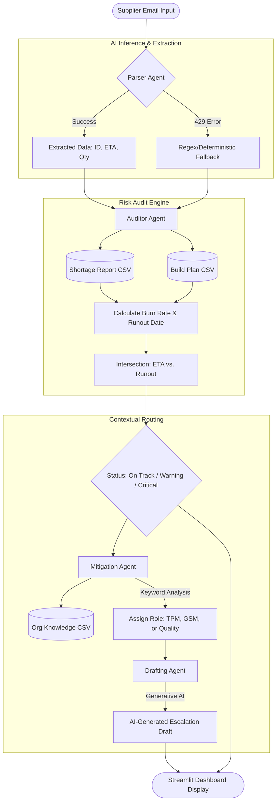

# NPI Agentic Control Tower
### **AI-Driven Supply Chain Risk Assessment & Mitigation**

The **NPI Agentic Control Tower** is a specialized decision-support tool designed for Material Planners and Technical Program Managers (TPMs) in the automotive industry. It bridges the gap between **unstructured supplier communication** and **structured ERP ground truth** by utilizing a multi-agent pipeline to predict line stoppages before they happen.

---

## The Mission
In high-stakes New Product Introduction (NPI) environments, a single delayed email can lead to a multi-million dollar line stoppage. This project automates the extraction, auditing, and escalation of supply chain risks, ensuring that "Actionable Intelligence" reaches the right stakeholder instantly—a workflow inspired by real-world NPI Materials Program Management.

---

## Core Agentic Architecture
The system utilizes a **Decoupled Agentic Pipeline** to ensure accuracy and reliability. This architecture was developed as part of the "Email Agent Assist" portfolio project in February 2026:


| Agent | Responsibility | Logic Type |
| :--- | :--- | :--- |
| **Parser Agent** | Extracts Part IDs, ETAs, and Quantities from raw text. | Generative (Gemini 2.0) |
| **Auditor Agent** | Calculates Burn Rates, Runout Dates, and Arrival Buffers. | Deterministic (Python/Pandas) |
| **Mitigation Agent** | Routes risks to specific POCs (TPM, GSM, or Quality). | Heuristic-Based Routing |
| **Drafting Agent** | Synthesizes technical risk data into professional escalations. | Generative (Context-Aware) |

### 🛰️ System Architecture


---


## Key Features

### **1. Temporal Risk Modeling**
Unlike static dashboards, this tool calculates a **Live Runout Date**. By intersecting your **Days on Hand (DOH)** with the supplier's **Revised ETA**, the system generates a "True Arrival Buffer".
* **Critical Status:** Triggered if ETA is after the Runout Date.
* **Warning Status:** Triggered if the safety buffer drops below a 2-day threshold.
* **On Track Status:** Confirms the supply chain is healthy relative to the build plan.

### **2. Matrix Organization Escalation**
The system identifies the "Nature of the Disruption" and routes it according to organizational knowledge:
* **Quality Issues:** Automatically routes to the Quality Lead for rework protocols.
* **Commercial/Cost Issues:** Escalates to the Global Supply Manager (GSM) for expedite negotiations.
* **Logistics/Timing:** Defaults to the NPI TPM to manage build schedule impact.

### **3. Optimized Operational UI**
The dashboard is built with **Streamlit** and optimized for high-density information display on mobile workstations (13-inch displays), utilizing expandable "drawers" to maintain focus on high-priority alerts.

---

## 🛠️ Technical Stack
* **Language:** Python 3.12
* **Frontend:** Streamlit
* **Intelligence:** Google Gemini 2.0 Flash API
* **Data Handling:** SQL and Pandas for relational CSV/database lookups
* **Resiliency:** Circuit-breaker patterns with Regex fallbacks for high-availability during API throttling.

---

## 🔧 Installation & Setup

1. **Clone the Repository:**
   ```bash
   git clone [https://github.com/aparnayalamanchi/NPI-Control-Tower.git](https://github.com/aparnayalamanchi/NPI-Control-Tower.git)
   cd NPI-Control-Tower

2.Set Up Environment:
Create a .env file and add your Gemini API Key:
```bash
    GEMINI_API_KEY=your_api_key_here
```
3. Initialize the System:
Run the project initializer to generate the local master data (Build Plans, Org Knowledge, and Shortage Reports):
```bash
python initialize_project.py
```
4. Launch the Dashboard:
```bash
streamlit run app.py
```
