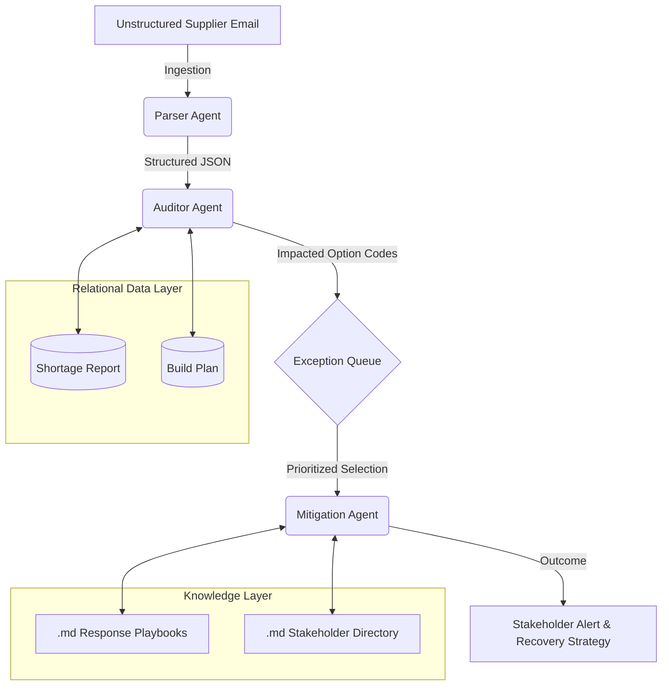

# NPI Agentic Control Tower: Automated Exception Management

## Product Vision
The **NPI Agentic Control Tower** is a decision-support system designed to eliminate the manual bottleneck of reconciling unstructured supplier communication with complex production schedules. By deploying a multi-agent orchestration layer, the platform transforms reactive "firefighting" into proactive, data-driven mitigation.

---

## The Problem: The "Visibility Gap"
In high-velocity New Product Introduction (NPI) environments, critical supply signals are often trapped in unstructured email threads. Traditional ERP systems fail to reconcile these signals against live build plans in real-time, leading to:
* **Information Asymmetry**: Planners lack immediate visibility into how a 48-hour part delay impacts specific vehicle configurations.
* **High Latency**: Manual cross-referencing between shortage reports and build plans delays the escalation process by hours or days.

---

## The Solution: Agentic Orchestration
Our solution utilizes three specialized agents to automate the risk-to-resolution lifecycle.

### 1. Signal Ingestion (Parser Agent)
* **Objective**: Digitize unstructured supplier updates into actionable data.
* **Logic**: Uses NLP to extract Part IDs, updated ETAs, and root causes from raw text, ensuring the system remains grounded in "Ground Truth" signals.

### 2. Relational Impact Analysis (Auditor Agent)
* **Objective**: Calculate the "Blast Radius" of a supply disruption.
* **Logic**: Performs a **Relational Audit** using Pandas to join part shortages with vehicle **Option Codes** and **Build Weeks**.
* **KPI**: Automatically prioritizes the **Action Queue** based on a dynamic Risk Score (Delay Duration / Inventory Buffer).

### 3. Automated Mitigation (Mitigation Agent)
* **Objective**: Standardize and accelerate the escalation process.
* **Logic**: Utilizes a **RAG-lite** framework to query Markdown-based organizational playbooks. It identifies the correct technical owner and drafts a tailored recovery plan.

---

## System Architecture


## Data Dictionary
The system maintains data integrity across three primary entities to ensure accurate auditing.

### 1. Master Supply Data (`shortage_report.csv`)
| Column Name | Data Type | Description |
| :--- | :--- | :--- |
| **Part_ID** | String | Unique identifier for the component (Primary Key). |
| **Subsystem** | String | The technical category (e.g., Battery, Chassis) used for stakeholder routing. |
| **On_Hand_Qty** | Integer | Current inventory level available in the local warehouse. |
| **Safety_Stock** | Integer | Minimum threshold required before a critical alert is triggered. |

### 2. Master Demand Data (`build_plan.csv`)
| Column Name | Data Type | Description |
| :--- | :--- | :--- |
| **Option_Code** | String | The specific vehicle configuration impacted by a shortage. |
| **Build_Week** | Date/String | The scheduled production week used to calculate impact urgency. |
| **Target_Qty** | Integer | Number of vehicles scheduled for production in the specified week. |

### 3. Processed Risk Data (`risk_ledger.csv`)
| Column Name | Data Type | Description |
| :--- | :--- | :--- |
| **Risk_Score** | Float | Calculated value (0.0 - 1.0) based on delay vs. inventory buffer. |
| **Status** | String | Categorical risk level (e.g., Critical, High Risk, Monitoring). |
| **Assigned_POC** | String | Stakeholder retrieved from playbooks for recovery ownership. |

---

## Technical Stack
* **Language**: Python 3.12 for core logic and agentic orchestration.
* **Data Processing**: Pandas for high-performance relational joins and feature engineering.
* **Interface**: Streamlit for an exception-based executive dashboard.
* **Intelligence Layer**: Custom Agentic logic utilizing structured JSON schemas for deterministic results.
* **Knowledge Management**: Markdown-based RAG-lite architecture for organizational playbooks.

---

## Setup & Deployment

### 1. Environment Configuration
Create and activate a virtual environment to manage dependencies:

```bash
python3 -m venv .venv
source .venv/bin/activate
```
### 2. Install Requirements
Install necessary libraries for data manipulation and the user interface:

```bash
pip install streamlit pandas
```
3. System Initialization
Run the initialization script to generate the local relational datasets and knowledge base:

```bash
python3 initialize_project.py
```
4. Run the Control Tower
Launch the dashboard to begin automated risk assessment:

```bash
streamlit run app.py
```
